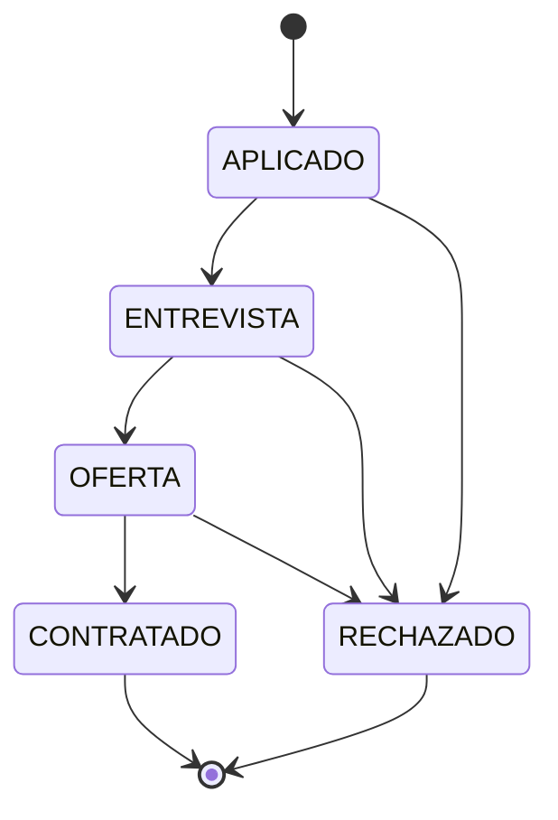

# HireCore - Diagrama de clases

| Requisito | Patrón | Clases |
|---|---|---|
| Transiciones válidas y extensibles | **State** | `IHireState`, `AppliedState`, `InterviewState`, `OfferState`, `HiredState`, `RejectedState` |
| Notificaciones diferenciadas | **Observer** | `IHireObserver`, `RecruiterObserver`, `HiringManagerObserver`, `PayrollObserver`, `CandidatePortalObserver`, `HireEvent` |
| Deshacer con auditoría | **Command** | `IHireCommand`, `ChangeStatusCommand`, `ICommandHistory`, `CommandHistory` |
| Guardar el estado previo | **Memento** | `CandidateMemento`, `Person.Save()`, `Person.Restore()` |

```mermaid
classDiagram
    direction LR

    class IHireState {
        <<interface>>
        +string Name
        +Next(string newStatus) IHireState
        +Message(string candidateName) string
    }
    class AppliedState {
        +string Name
        +Next(string newStatus) IHireState
        +Message(string candidateName) string
    }
    class InterviewState {
        +string Name
        +Next(string newStatus) IHireState
        +Message(string candidateName) string
    }
    class OfferState {
        +string Name
        +Next(string newStatus) IHireState
        +Message(string candidateName) string
    }
    class HiredState {
        +string Name
        +Next(string newStatus) IHireState
        +Message(string candidateName) string
    }
    class RejectedState {
        +string Name
        +Next(string newStatus) IHireState
        +Message(string candidateName) string
    }

    IHireState <|.. AppliedState
    IHireState <|.. InterviewState
    IHireState <|.. OfferState
    IHireState <|.. HiredState
    IHireState <|.. RejectedState
    AppliedState ..> InterviewState
    AppliedState ..> RejectedState
    InterviewState ..> OfferState
    InterviewState ..> RejectedState
    OfferState ..> HiredState
    OfferState ..> RejectedState

    class HireStatus {
        <<static>>
        +string STATUS_APLICADO
        +string STATUS_ENTREVISTA
        +string STATUS_OFERTA
        +string STATUS_CONTRATADO
        +string STATUS_RECHAZADO
    }
    AppliedState ..> HireStatus
    InterviewState ..> HireStatus
    OfferState ..> HireStatus
    HiredState ..> HireStatus
    RejectedState ..> HireStatus

    class Person {
        +int Id
        +string Name
        +Document Document
        +string Address
        +string Email
        +string RecruiterEmail
        +DateTime Birthdate
        +IHireState State
        +Collection~JobOffer~ Oferts
        +Save() CandidateMemento
        +Restore(CandidateMemento memento) void
    }
    class Document {
        +string DocumentType
        +string DocumentNumber
    }
    class JobOffer {
        +string Title
        +string Description
        +DateTime PostedDate
        +string Status
        +bool IsActive
    }
    class CandidateMemento {
        +IHireState State
        +CandidateMemento(IHireState state)
    }

    Person *-- Document
    Person *-- "0..*" JobOffer
    Person --> IHireState
    Person ..> CandidateMemento
    CandidateMemento --> IHireState

    class IHireService {
        <<interface>>
        +ChangeStatus(string documentType, string documentNumber, string newStatus, string executedBy) Task~ResponseDto~
        +Undo(string executedBy) Task~ResponseDto~
        +AuditTrail() IReadOnlyList~IHireCommand~
    }
    class HireService {
        -IEnumerable~IHireObserver~ _observers
        -ICommandHistory _history
        -List~Person~ _person
        +HireService(IEnumerable~IHireObserver~ observers, ICommandHistory history)
        +ChangeStatus(string documentType, string documentNumber, string newStatus, string executedBy) Task~ResponseDto~
        +Undo(string executedBy) Task~ResponseDto~
        +AuditTrail() IReadOnlyList~IHireCommand~
    }
    IHireService <|.. HireService
    HireService o-- "0..*" IHireObserver
    HireService o-- ICommandHistory
    HireService *-- "0..*" Person
    HireService ..> ChangeStatusCommand
    HireService ..> ResponseDto

    class IHireCommand {
        <<interface>>
        +string ExecutedBy
        +DateTime ExecutedAt
        +string UndoneBy
        +DateTime UndoneAt
        +string Description
        +Execute() Task~ResponseDto~
        +Undo(string undoneBy) Task
    }
    class ChangeStatusCommand {
        -Person _candidate
        -string _newStatus
        -IEnumerable~IHireObserver~ _observers
        -CandidateMemento _memento
        -string _previousStatus
        +string ExecutedBy
        +DateTime ExecutedAt
        +string UndoneBy
        +DateTime UndoneAt
        +string Description
        +ChangeStatusCommand(Person candidate, string newStatus, string executedBy, IEnumerable~IHireObserver~ observers)
        +Execute() Task~ResponseDto~
        +Undo(string undoneBy) Task
        -Publish(string previousStatus, string newStatus, string message, bool isInternal) Task
    }
    class ICommandHistory {
        <<interface>>
        +IReadOnlyList~IHireCommand~ Log
        +Push(IHireCommand command) void
        +Pop() IHireCommand
    }
    class CommandHistory {
        -Stack~IHireCommand~ _executed
        -List~IHireCommand~ _log
        +IReadOnlyList~IHireCommand~ Log
        +Push(IHireCommand command) void
        +Pop() IHireCommand
    }

    IHireCommand <|.. ChangeStatusCommand
    ICommandHistory <|.. CommandHistory
    CommandHistory o-- "0..*" IHireCommand
    ChangeStatusCommand --> Person
    ChangeStatusCommand --> CandidateMemento
    ChangeStatusCommand o-- "0..*" IHireObserver
    ChangeStatusCommand ..> HireEvent
    ChangeStatusCommand ..> ResponseDto

    class HireEvent {
        +Person Candidate
        +string PreviousStatus
        +string NewStatus
        +string Message
        +bool IsInternal
        +DateTime OccurredAt
    }
    HireEvent --> Person

    class IHireObserver {
        <<interface>>
        +Notify(HireEvent hireEvent) Task
    }
    class RecruiterObserver {
        -IServiceNotifications _serviceNotifications
        +RecruiterObserver(IServiceNotifications serviceNotifications)
        +Notify(HireEvent hireEvent) Task
    }
    class HiringManagerObserver {
        -string RECIPIENT
        -IServiceNotifications _serviceNotifications
        +HiringManagerObserver(IServiceNotifications serviceNotifications)
        +Notify(HireEvent hireEvent) Task
    }
    class PayrollObserver {
        -string RECIPIENT
        -IServiceNotifications _serviceNotifications
        +PayrollObserver(IServiceNotifications serviceNotifications)
        +Notify(HireEvent hireEvent) Task
    }
    class CandidatePortalObserver {
        -IServiceNotifications _serviceNotifications
        +CandidatePortalObserver(IServiceNotifications serviceNotifications)
        +Notify(HireEvent hireEvent) Task
    }

    IHireObserver <|.. RecruiterObserver
    IHireObserver <|.. HiringManagerObserver
    IHireObserver <|.. PayrollObserver
    IHireObserver <|.. CandidatePortalObserver
    IHireObserver ..> HireEvent
    RecruiterObserver o-- IServiceNotifications
    HiringManagerObserver o-- IServiceNotifications
    PayrollObserver o-- IServiceNotifications
    CandidatePortalObserver o-- IServiceNotifications
    HiringManagerObserver ..> HireStatus
    PayrollObserver ..> HireStatus

    class IServiceNotifications {
        <<interface>>
        +SendNotification(string to, string subject, string body) Task~ResponseDto~
    }
    class ServiceNotifications {
        +SendNotification(string to, string subject, string body) Task~ResponseDto~
    }
    class ResponseDto {
        +bool Success
        +string Message
        +object Data
    }
    IServiceNotifications <|.. ServiceNotifications
    ServiceNotifications ..> ResponseDto

    class Program {
        -IHireService _hireService
        +Program(IHireService hireService)
        -ConfigureServices() IServiceProvider
        +Main(string[] args) Task
        -Run() Task
        -Print(ResponseDto response) void
    }
    Program o-- IHireService
    Program ..> ICommandHistory
    Program ..> IHireObserver
    Program ..> IServiceNotifications
    Program ..> HireStatus
```

## Máquina de estados

## Matriz de notificaciones

| Destinatario | ENTREVISTA | OFERTA | CONTRATADO | RECHAZADO | Eventos internos (undo) |
|---|---|---|---|---|---|
| Reclutador | si | si | si | si | si |
| Gerente de contratación | no | si | si | no | si |
| Nómina | no | no | si | no | si |
| Portal del candidato | si | si | si | si | no |
